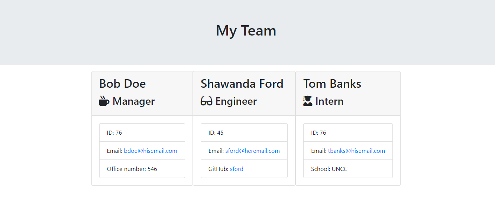

# TeamProfileGenerator

## Description
This is a software engineering command-line application that receives information about employees and generates an HTML webpage that displays summaries for each person.  This app uses: HTML, JQuery, and Node.js.

## Screenshot of website  

![Video Tutorial][README Creation Video](https://drive.google.com/file/d/1OeR3uCoW-9dXI1WafmXVyq3L7CAMN6Aj/view) 

## Github Repository

[TeamProfileGenerator](https://github.com/sford4186/TeamProfileGenerator)

 